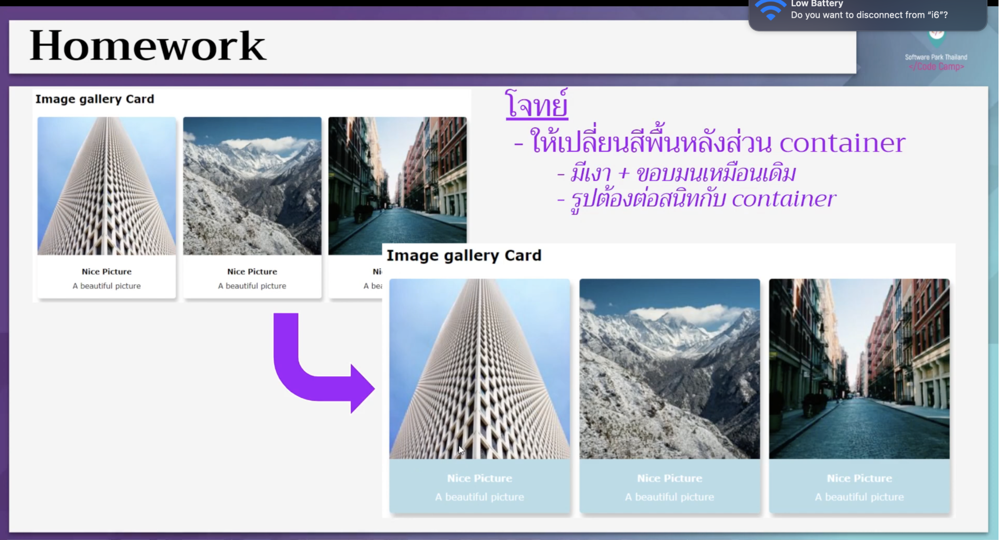

# CodeCamp Online #13

# Tanapron Kiewcomgoon

โจทย์ CSS ข้อที่ 1
- ให้เปลี่ยนสีพื้นหลังส่วน container
- มีเงา + ขอบมนเหมือนเดิม
- รูปต้องต่อสนิทกับ container

[Link to Preview](https://tanapron.github.io/Homework_codecamp_13/CSS/ข้อที่%201/hw_css01.html)

