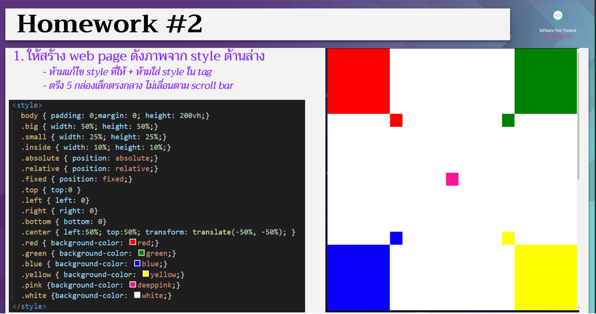

# CodeCamp Online #13

# Tanapron Kiewcomgoon

โจทย์ CSS ข้อที่ 2
- ให้สร้าง web page ดังภาพจาก style ด้านล่าง
- ห้ามแก้ไข style ที่ให้ + ห้ามใส่ style ใน tag
- ตรึง 5 กล่องเล็กตรงกลาง ไม่เลื่อนตาม scroll bar

[Link to Preview](https://github.com/TANAPRON/tanapron.github.io/blob/dea7f5d1f76f37111ff707e4aa7a528005cd7077/Homework_codecamp_13/CSS/%E0%B8%82%E0%B9%89%E0%B8%AD%E0%B8%97%E0%B8%B5%E0%B9%88%202/hw_css02.html)

