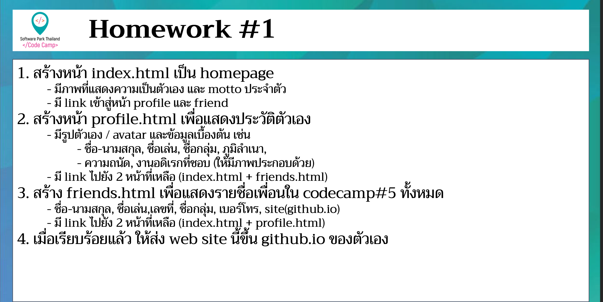

# CodeCamp Online #13

# Tanapron Kiewcomgoon

โจทย์ HTML ข้อที่ 1
1. สร้างหน้า index.html เป็น homepage
- มีภาพที่แสดงความเป็นตัวเอง และ motto ประจำตัว
- มี link เข้าสู่หน้า profile และ friend
2. สร้างหน้า profile.html เพื่อแสดงประวัติตัวเอง
- มีรูปตัวเอง/avatar และข้อมูลเบื้องต้น
เช่น ชื่อ-นามสกุล,ชื่อเล่น,ชื่อกลุ่ม,ภูมิลำเนา,ความถนัด,งานอดิเรกที่ชอบ
- มี link ไปยัง 2 หน้าที่เหลือ
3. สร้าง friend.html เพื่อแสดงรายชื่อเพื่อนใน camp ทั้งหมด
- ชื่อ-นามสกุล,ชื่อเล่น,เลขที่,ชื่อกลุ่ม,เบอร์โทร,site(github.io)
- มี link ไปยัง 2 หน้าที่เหลือ
4. เมื่อเรียบแล้วให้ส่ง web ขึ้น github.io ของตัวเอง

[Link to Preview](https://tanapron.github.io/Homework_codecamp_13/HTML/ข้อที่%201/index.html)
