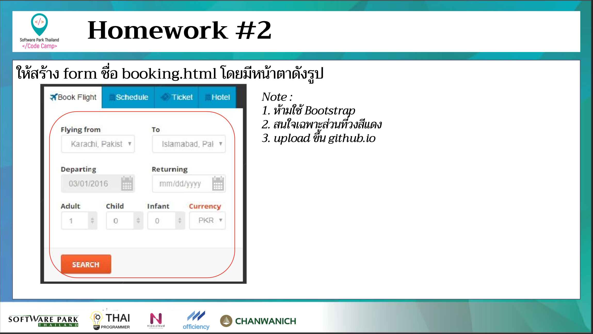

# CodeCamp Online #13

# Tanapron Kiewcomgoon

โจทย์ HTML ข้อที่ 2
- ให้สร้าง form ชื่อ booking.html โดยมีหน้าตาดังรูป

note: 
1. ห้ามใช้ Bootstrap
2. สนใจเฉพาะส่วนที่วงสีแดง
3. upload ขึ้น github.io

[Link to Preview](https://tanapron.github.io/Homework_codecamp_13/HTML/ข้อที่%201/index.html)
